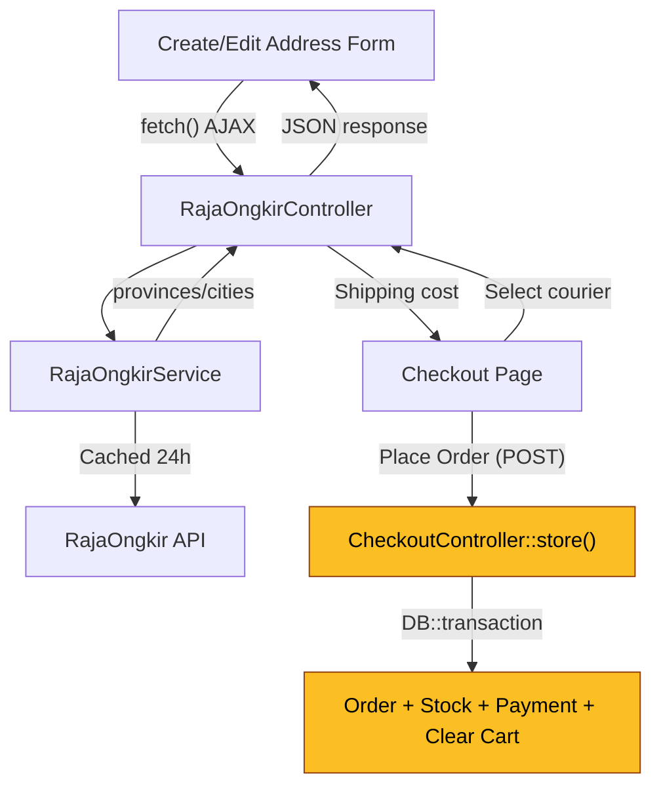

# ✅ RajaOngkir Integration — Completion Summary

## All Steps Completed

### Step 1: Backend Setup
| File | Action |
|------|--------|
| [.env](file:///d:/Documents/SMK%20XI/Project/MAMP/Laravel/STS/.env) | Added `RAJAONGKIR_API_KEY` and `RAJAONGKIR_ORIGIN_CITY_ID` |
| [config/services.php](file:///d:/Documents/SMK%20XI/Project/MAMP/Laravel/STS/config/services.php) | Added `rajaongkir` config block |
| [Migration](file:///d:/Documents/SMK%20XI/Project/MAMP/Laravel/STS/database/migrations/2026_05_12_000001_add_rajaongkir_ids_to_shipping_addresses_table.php) | Added `province_id`, `city_id` columns ✅ Migrated |
| [RajaOngkirService.php](file:///d:/Documents/SMK%20XI/Project/MAMP/Laravel/STS/app/Services/RajaOngkirService.php) | **NEW** — API wrapper with caching |

### Step 2: API Controller & Routes
| File | Action |
|------|--------|
| [RajaOngkirController.php](file:///d:/Documents/SMK%20XI/Project/MAMP/Laravel/STS/app/Http/Controllers/Api/RajaOngkirController.php) | **NEW** — 3 endpoints (provinces, cities, cost) |
| [routes/web.php](file:///d:/Documents/SMK%20XI/Project/MAMP/Laravel/STS/routes/web.php) | Added `/customer/api/rajaongkir/*` routes |

### Step 3: ShippingAddress Updates
| File | Action |
|------|--------|
| [ShippingAddress.php](file:///d:/Documents/SMK%20XI/Project/MAMP/Laravel/STS/app/Models/ShippingAddress.php) | Added `province_id`, `city_id` to `$fillable` |
| [ShippingAddressController.php](file:///d:/Documents/SMK%20XI/Project/MAMP/Laravel/STS/app/Http/Controllers/Customer/ShippingAddressController.php) | Updated validation rules |
| [create.blade.php](file:///d:/Documents/SMK%20XI/Project/MAMP/Laravel/STS/resources/views/customer/shipping-addresses/create.blade.php) | **Rewritten** — Dependent dropdown with Alpine.js |
| [edit.blade.php](file:///d:/Documents/SMK%20XI/Project/MAMP/Laravel/STS/resources/views/customer/shipping-addresses/edit.blade.php) | **Rewritten** — Dependent dropdown with pre-populated values |

### Step 4: Checkout Shipping Cost
| File | Action |
|------|--------|
| [checkout.blade.php](file:///d:/Documents/SMK%20XI/Project/MAMP/Laravel/STS/resources/views/customer/checkout.blade.php) | Added courier selector + live ongkir calculator |
| [layouts/customer.blade.php](file:///d:/Documents/SMK%20XI/Project/MAMP/Laravel/STS/resources/views/layouts/customer.blade.php) | Added `<meta name="csrf-token">` for AJAX |

> [!IMPORTANT]
> The `CheckoutController::store()` DB::transaction block was **NOT modified** — it remains fully atomic.

---

## 🔧 Before Testing — Required Actions

1. **Set your RajaOngkir API Key** in `.env`:
   ```
   RAJAONGKIR_API_KEY=your_actual_starter_key_here
   ```

2. **Set your store's origin city ID** in `.env`:
   ```
   RAJAONGKIR_ORIGIN_CITY_ID=501
   ```
   > Find your city ID at [rajaongkir.com](https://rajaongkir.com) or by calling the provinces→cities endpoint.

3. **Clear config cache**: `php artisan config:clear` (already done)

---

## Architecture Diagram


